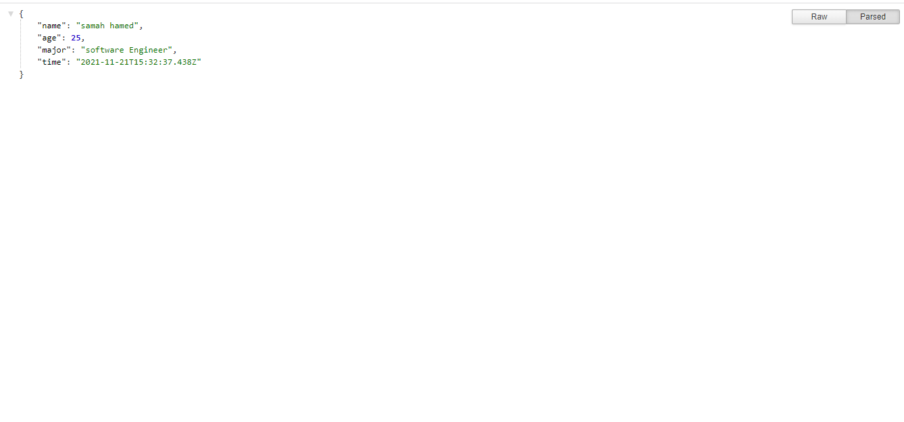
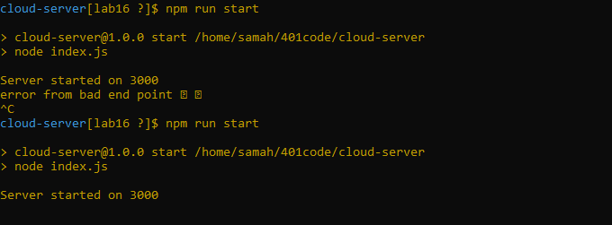

# cloud-server

* [GitHub Repo Link](https://github.com/samahhamed227/cloud-server)

# install
* 

* 

* 

* 

* 

#  outPut :
## ***link*** :http://localhost:3000/about.html

## ***link*** : http://localhost:3000/bad

## ***link*** : http://localhost:3000

!

## ***link*** : http://localhost:3000/data

## server

### UML 👍
